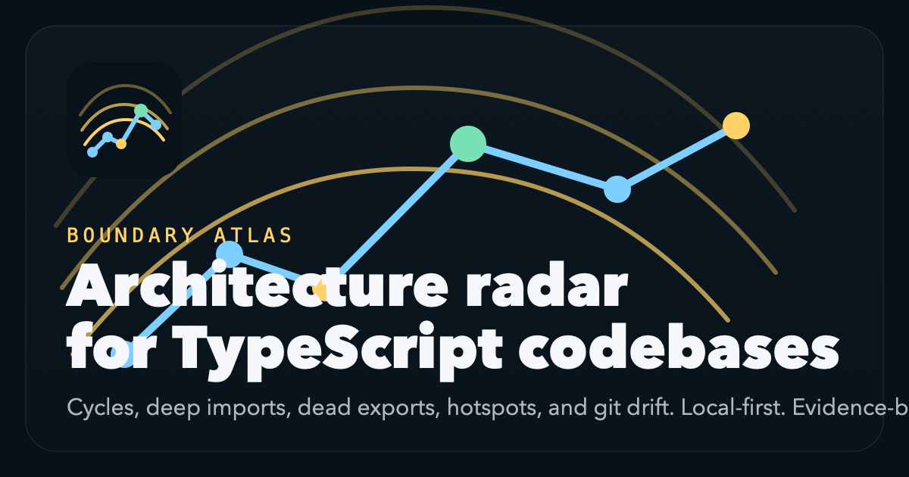

# Boundary Atlas



Boundary Atlas is a local-first architecture radar for real TypeScript and JavaScript repositories. It parses source with `ts-morph`, builds file/folder/package graphs, and exports evidence-backed reports for:

- module and package boundaries
- dependency cycles
- fan-in and fan-out hotspots
- deep import violations
- dead exports
- risky cross-feature dependencies
- architecture drift between two git refs

No hosted services. No paid APIs. No fake scores.

## Scope

v1 is intentionally TS/JS-only. Boundary Atlas analyzes static imports, re-exports, public entrypoints, and derived graph structure inside the repository you point it at.

## Screens


## Install

```bash
npm install
```

## Quick Start

Analyze a repo and write JSON plus Markdown:

```bash
node packages/cli/dist/index.js analyze ./fixtures/ts-cycle-dashboard \
  --json ./output/ts-cycle-dashboard.json \
  --markdown ./output/ts-cycle-dashboard.md
```

Export the interactive offline HTML viewer:

```bash
npm run build
node packages/cli/dist/index.js analyze ./fixtures/ts-cross-feature-portal \
  --html ./output/ts-cross-feature-portal-html
```

Compare two refs for architecture drift:

```bash
node packages/cli/dist/index.js diff . \
  --base HEAD~1 \
  --head HEAD \
  --json ./output/self-drift.json \
  --markdown ./output/self-drift.md
```

Generate the committed demo artifacts:

```bash
npm run demo:fixtures
npm run demo:self
```

## Config

Boundary Atlas auto-loads `boundary-atlas.config.json` from the target repo when present.

Example:

```json
{
  "publicEntrypoints": [
    "packages/*/src/index.ts",
    "**/index.ts",
    "**/index.js"
  ],
  "boundaries": [
    {
      "name": "cli-to-core",
      "from": ["packages/cli/src/**"],
      "allow": ["packages/cli/src/**", "packages/core/src/**"]
    }
  ]
}
```

`from` matches importer paths. `allow` matches target paths. Any edge that matches a rule's `from` globs but not its `allow` globs is reported as a boundary violation.

## Output Formats

- JSON: full report payload with graphs, findings, hotspots, dead exports, and optional drift.
- Markdown: readable audit report with the same derived facts.
- HTML: offline interactive viewer with embedded report payload.

Committed sample outputs live under [`docs/samples`](docs/samples).

## Architecture

- `packages/core`: source graph extraction, cycle detection, deep import detection, dead export analysis, hotspot detection, and git-ref diffing.
- `packages/cli`: local CLI for `analyze` and `diff`, plus JSON/Markdown/HTML export.
- `apps/web`: React + Vite report viewer using `react-force-graph-2d`.
- `fixtures`: intentionally-bad repos that prove the detectors fire on concrete evidence.

The core report model is graph-first. File-level edges are the source of truth. Folder and package views are derived by aggregation, not separate parsers.

## Fixtures

Boundary Atlas ships with four small repos that each demonstrate a specific failure mode:

- [`fixtures/ts-cycle-dashboard`](fixtures/ts-cycle-dashboard): barrel-driven cycle
- [`fixtures/js-deep-import-storefront`](fixtures/js-deep-import-storefront): deep imports into `internal` modules
- [`fixtures/ts-dead-exports-reporting`](fixtures/ts-dead-exports-reporting): dead exports alongside live siblings
- [`fixtures/ts-cross-feature-portal`](fixtures/ts-cross-feature-portal): risky feature-to-feature fan-out

Run `npm run demo:fixtures` to regenerate their committed reports.

## Self Demo

`npm run demo:self` analyzes Boundary Atlas itself using the repo-root [`boundary-atlas.config.json`](boundary-atlas.config.json). If the repo has at least two commits, it also exports a self-diff report for `HEAD~1 -> HEAD`.

## Validation

```bash
npm install
npm run lint
npm run typecheck
npm run test
npm run e2e
npm run build
npm run demo:fixtures
npm run demo:self
```

## GitHub Actions

CI runs lint, typecheck, unit tests, build, fixture demos, self demo, and browser e2e in GitHub Actions.

## Push

If GitHub auth is available:

```bash
git add .
git commit -m "Build Boundary Atlas"
git remote add origin git@github.com:<your-user>/boundary-atlas.git
git push -u origin main
```

If auth is already configured and the repo exists, replace the remote URL and push normally.
