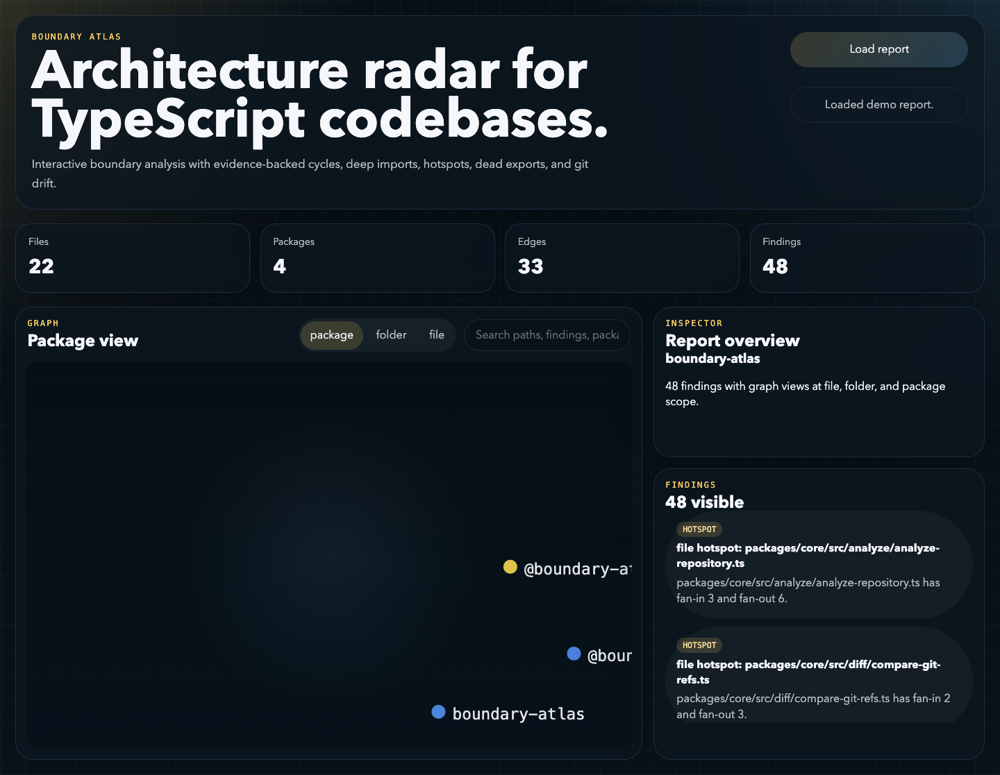
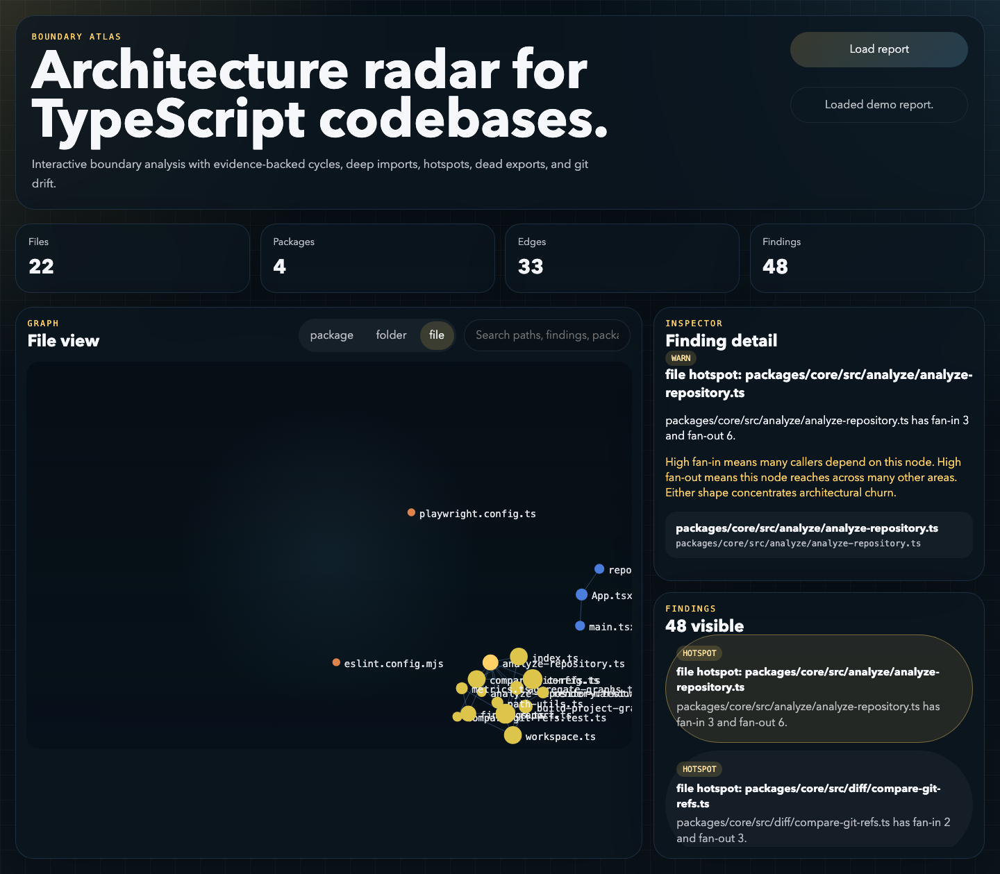
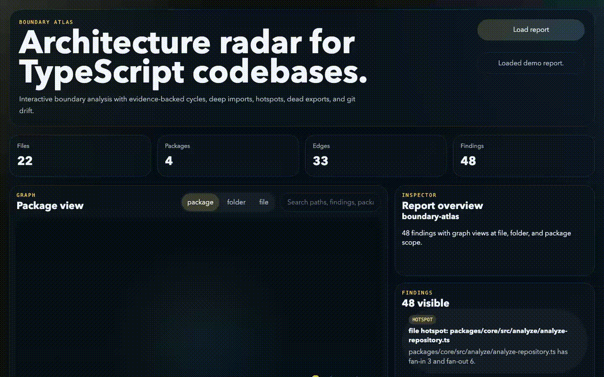

# Boundary Atlas


Boundary Atlas is a local-first architecture radar for TypeScript and JavaScript repositories. It parses real imports with `ts-morph`, builds file, folder, and package graphs, and turns them into evidence-backed findings you can ship as JSON, Markdown, or an offline HTML viewer.

No SaaS. No API keys. No vague health score.

If Boundary Atlas saves you review time, the smallest support path is the $5 Codex run receipt: <https://nicdunz.gumroad.com/l/smrimu>.

## What It Catches

| Signal | What Boundary Atlas flags | Why it matters |
| --- | --- | --- |
| Cycles | strongly connected file, folder, or package graphs | change direction stops being obvious and unrelated work starts moving together |
| Deep imports | imports that bypass a public entrypoint and reach into internals | a private refactor can break another area without any API change |
| Boundary violations | imports that cross a configured allow-list boundary | architecture rules stop being real once they are unenforced |
| Cross-feature dependencies | one feature reaching into several peer features | ownership blurs and coordinated releases become more likely |
| Dead exports | exports that are not imported or re-exported internally | stale surface area makes real API harder to recognize |
| Hotspots | nodes with unusually high fan-in or fan-out | churn concentrates around the same files and folders |
| Git drift | findings and hotspots added or removed between two refs | architectural regression becomes visible in code review windows |

## Demo Proof

Boundary Atlas ships with committed fixtures, committed reports, and committed screenshots so the repo proves itself immediately.

- Sample output index: [`docs/samples/README.md`](docs/samples/README.md)
- Fixture catalog: [`fixtures/README.md`](fixtures/README.md)
- Default web demo report: `ts-cross-feature-portal`, preloaded in the viewer with a high-severity finding selected

```text
Boundary Atlas: ts-cross-feature-portal
Files: 9
Packages: 1
Edges: 10
Findings: 5
High severity: 1

Signals:
- cross-feature edges: 2
- dead exports: 1
- hotspots: 2

Top findings:
- [high][cross-feature] Cross-feature fan-out from src/features/checkout
- [warn][cross-feature] Cross-feature fan-out from src/features/reporting
- [warn][dead-export] Unused export opsPortalSnapshot
```

## Screens







## Quick Start

Install dependencies:

```bash
npm install
```

Install the Playwright browser once if you want local e2e runs or to regenerate screenshots:

```bash
npx playwright install chromium
```

Build the CLI and viewer:

```bash
npm run build
```

Analyze a repo and write JSON plus Markdown:

```bash
node packages/cli/dist/index.js analyze ./fixtures/ts-cycle-dashboard \
  --json ./output/ts-cycle-dashboard.json \
  --markdown ./output/ts-cycle-dashboard.md
```

Export the offline HTML viewer:

```bash
node packages/cli/dist/index.js analyze ./fixtures/ts-cross-feature-portal \
  --html ./output/ts-cross-feature-portal-html
```

Compare two refs for architecture drift:

```bash
node packages/cli/dist/index.js diff . \
  --base HEAD~1 \
  --head HEAD \
  --json ./output/self-drift.json \
  --markdown ./output/self-drift.md
```

## Committed Outputs

Boundary Atlas keeps proof artifacts in the repo instead of asking you to trust the claims.

- [`docs/samples/README.md`](docs/samples/README.md): index of committed reports
- [`docs/samples/fixtures/ts-cycle-dashboard/report.md`](docs/samples/fixtures/ts-cycle-dashboard/report.md): cycle report
- [`docs/samples/fixtures/js-deep-import-storefront/report.md`](docs/samples/fixtures/js-deep-import-storefront/report.md): deep import report
- [`docs/samples/fixtures/ts-dead-exports-reporting/report.md`](docs/samples/fixtures/ts-dead-exports-reporting/report.md): dead export report
- [`docs/samples/fixtures/ts-cross-feature-portal/report.md`](docs/samples/fixtures/ts-cross-feature-portal/report.md): cross-feature fan-out report
- [`docs/samples/self/report.md`](docs/samples/self/report.md): self-analysis report for this repo

## Config

Boundary Atlas auto-loads `boundary-atlas.config.json` from the target repo when present.

Example:

```json
{
  "publicEntrypoints": [
    "packages/*/src/index.ts",
    "**/index.ts",
    "**/index.js"
  ],
  "boundaries": [
    {
      "name": "cli-to-core",
      "from": ["packages/cli/src/**"],
      "allow": ["packages/cli/src/**", "packages/core/src/**"]
    }
  ]
}
```

`from` matches importer paths. `allow` matches target paths. If an import matches `from` but not `allow`, Boundary Atlas reports it as a boundary violation with the concrete edge evidence.

## Output Formats

- JSON: full payload with graphs, findings, hotspots, dead exports, and optional drift
- Markdown: readable audit report with the same derived facts plus prioritized findings
- HTML: offline interactive viewer with the report embedded into the page

## Repo Layout

- `packages/core`: graph extraction, detectors, and report rendering
- `packages/cli`: `analyze` and `diff` commands plus JSON, Markdown, and HTML export
- `apps/web`: offline report viewer built with React and Vite
- `fixtures`: intentionally flawed repos that prove each detector fires on real source structure
- `docs/samples`: committed output proof for fixtures and self-analysis

## Demo Regeneration

Refresh the committed proof artifacts:

```bash
npm run build
npm run demo:fixtures
npm run demo:self
npm run docs:assets
```

## Validation

```bash
npm run verify
```

The full browser pass is available separately:

```bash
npm run lint
npm run typecheck
npm run test
npm run build
npm run demo:fixtures
npm run demo:self
npm run e2e
```

## Scope

v1 is intentionally TS/JS-only. Boundary Atlas analyzes static imports, re-exports, public entrypoints, configured boundaries, and graph structure inside the repository you point it at.
